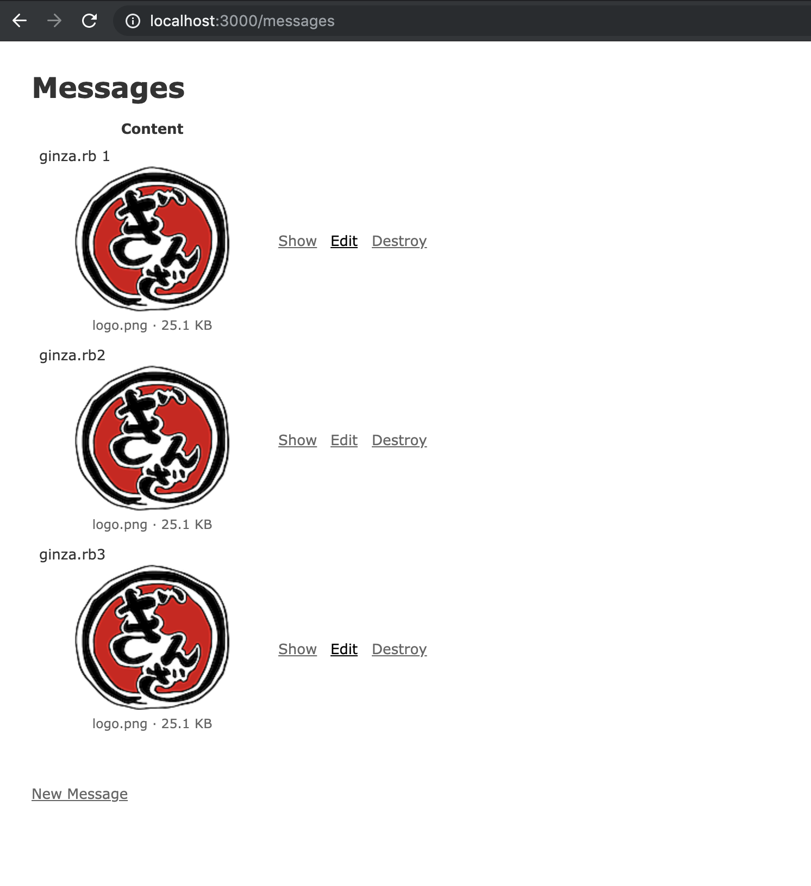

# README

Sample Rails Application for [eager load doesn't work as expected in Action Text · Issue #36177 · rails/rails](https://github.com/rails/rails/issues/36177)

## Setup

1. git clone
2. ./bin/setup
3. Add some messages like this



4. see log/development.log

ex:
```
Started GET "/messages" for ::1 at 2019-07-21 10:55:02 +0900
   (0.3ms)  SELECT sqlite_version(*)
   (0.1ms)  SELECT "schema_migrations"."version" FROM "schema_migrations" ORDER BY "schema_migrations"."version" ASC
Processing by MessagesController#index as HTML
  Rendering messages/index.html.erb within layouts/application
  Message Load (0.1ms)  SELECT "messages".* FROM "messages"
  ↳ app/views/messages/index.html.erb:14
  ActionText::RichText Load (0.2ms)  SELECT "action_text_rich_texts".* FROM "action_text_rich_texts" WHERE "action_text_rich_texts"."record_type" = ? AND "action_text_rich_texts"."name" = ? AND "action_text_rich_texts"."record_id" IN (?, ?, ?)  [["record_type", "Message"], ["name", "content"], ["record_id", 1], ["record_id", 2], ["record_id", 3]]
  ↳ app/views/messages/index.html.erb:14
  ActiveStorage::Attachment Load (0.3ms)  SELECT "active_storage_attachments".* FROM "active_storage_attachments" WHERE "active_storage_attachments"."record_type" = ? AND "active_storage_attachments"."name" = ? AND "active_storage_attachments"."record_id" IN (?, ?, ?)  [["record_type", "ActionText::RichText"], ["name", "embeds"], ["record_id", 1], ["record_id", 2], ["record_id", 3]]
  ↳ app/views/messages/index.html.erb:14
  ActiveStorage::Blob Load (0.1ms)  SELECT "active_storage_blobs".* FROM "active_storage_blobs" WHERE "active_storage_blobs"."id" IN (?, ?, ?)  [["id", 1], ["id", 2], ["id", 3]]
  ↳ app/views/messages/index.html.erb:14
  ActiveStorage::Blob Load (0.2ms)  SELECT "active_storage_blobs".* FROM "active_storage_blobs" WHERE "active_storage_blobs"."id" = ? LIMIT ?  [["id", 1], ["LIMIT", 1]]
  ↳ app/views/messages/index.html.erb:16
  Rendered active_storage/blobs/_blob.html.erb (Duration: 7.6ms | Allocations: 3147)
  Rendered /Users/willnet/.rbenv/versions/2.6.3/lib/ruby/gems/2.6.0/bundler/gems/rails-a390001bbe48/actiontext/app/views/action_text/content/_layout.html.erb (Duration: 14.5ms | Allocations: 7143)
  ActiveStorage::Blob Load (0.2ms)  SELECT "active_storage_blobs".* FROM "active_storage_blobs" WHERE "active_storage_blobs"."id" = ? LIMIT ?  [["id", 2], ["LIMIT", 1]]
  ↳ app/views/messages/index.html.erb:16
  Rendered active_storage/blobs/_blob.html.erb (Duration: 0.7ms | Allocations: 521)
  Rendered /Users/willnet/.rbenv/versions/2.6.3/lib/ruby/gems/2.6.0/bundler/gems/rails-a390001bbe48/actiontext/app/views/action_text/content/_layout.html.erb (Duration: 5.5ms | Allocations: 3717)
  ActiveStorage::Blob Load (0.1ms)  SELECT "active_storage_blobs".* FROM "active_storage_blobs" WHERE "active_storage_blobs"."id" = ? LIMIT ?  [["id", 3], ["LIMIT", 1]]
  ↳ app/views/messages/index.html.erb:16
  Rendered active_storage/blobs/_blob.html.erb (Duration: 0.9ms | Allocations: 521)
  Rendered /Users/willnet/.rbenv/versions/2.6.3/lib/ruby/gems/2.6.0/bundler/gems/rails-a390001bbe48/actiontext/app/views/action_text/content/_layout.html.erb (Duration: 4.6ms | Allocations: 3739)
  Rendered messages/index.html.erb within layouts/application (Duration: 90.7ms | Allocations: 52152)
Completed 200 OK in 927ms (Views: 911.9ms | ActiveRecord: 3.1ms | Allocations: 1507212)
```

There are many `ActiveStorage::Blob Load`!
